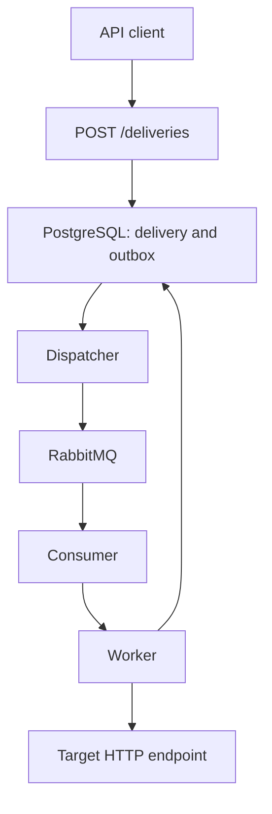

# Webhook Delivery Service

A portfolio backend project for reliable asynchronous webhook delivery using FastAPI, PostgreSQL, RabbitMQ, and Python.

The service accepts webhook delivery requests, stores them durably, publishes delivery messages through RabbitMQ, and sends the final HTTP requests through an asynchronous worker.

> **Status:** Work in progress. The successful delivery path works end to end, while some production-oriented capabilities are still planned.

## Architecture



The delivery flow is:

1. A client calls `POST /deliveries`.
2. Pydantic validates the JSON request.
3. A `WebhookDelivery` and an `OutboxMessage` are stored in the same PostgreSQL transaction.
4. The dispatcher reads unpublished outbox messages.
5. The dispatcher publishes a persistent `webhook.delivery.requested` message to RabbitMQ.
6. The long-running consumer receives the message and loads the delivery from PostgreSQL.
7. The worker sends the webhook through HTTPX.
8. The delivery is updated as `succeeded`, `retry_scheduled`, or `failed`.
9. Successfully handled RabbitMQ messages are acknowledged.
10. The consumer continues waiting for additional messages.

## Reliability Design

### Transactional Outbox

The delivery and its publication intent are stored atomically in PostgreSQL.

This avoids the dual-write problem where a delivery could be stored successfully but the application could stop before notifying RabbitMQ.

The dispatcher publishes rows whose `published_at` value is `NULL`. After a successful RabbitMQ publication, it records the publication timestamp.

### At-Least-Once Processing

A message may be delivered more than once if a process stops after performing work but before recording completion.

The worker therefore includes terminal-state guards to avoid processing deliveries already marked as `succeeded` or `failed`.

### Retry State

Failed HTTP attempts are handled using:

- capped exponential backoff,
- jitter,
- a maximum number of attempts,
- `next_attempt_at`,
- `last_error`,
- terminal `failed` status.

Automatic scheduling and execution of due retries is not implemented yet.

## Technology Stack

- Python 3.14
- FastAPI
- Pydantic
- PostgreSQL
- SQLAlchemy ORM
- Psycopg
- Alembic
- RabbitMQ
- aio-pika
- HTTPX
- Docker Compose
- pytest

## API Endpoints

### Liveness

```http
GET /health/live
```

Checks whether the API process is running.

### Readiness

```http
GET /health/ready
```

Checks whether the API can connect to PostgreSQL.

### Create Delivery

```http
POST /deliveries
```

Example request:

```json
{
  "target_url": "https://example.com/webhooks",
  "event_type": "order.created",
  "payload": {
    "order_id": 123
  }
}
```

A newly created delivery starts with:

```json
{
  "status": "pending",
  "attempt_count": 0,
  "next_attempt_at": null,
  "last_error": null,
  "delivered_at": null
}
```

### Get Delivery

```http
GET /deliveries/{delivery_id}
```

Returns the current delivery state.

## Local Setup

### Requirements

- Python 3.14
- Docker Desktop
- Docker Compose
- Git

On Windows, Docker Desktop requires WSL 2 and hardware virtualization.

### Clone and Install

```powershell
git clone https://github.com/dionysisterziou/webhook-delivery-service.git
cd webhook-delivery-service

python -m venv .venv
.\.venv\Scripts\Activate.ps1

python -m pip install --editable ".[dev]"
```

### Environment Configuration

Create the local environment file:

```powershell
Copy-Item .env.example .env
```

When the Python processes run directly on Windows and PostgreSQL and RabbitMQ run through Docker, ensure the following values exist in `.env`:

```dotenv
POSTGRES_HOST=127.0.0.1
RABBITMQ_HOST=127.0.0.1
```

Using `127.0.0.1` also avoids slow IPv6-to-IPv4 fallback during local database connections.

### Start PostgreSQL and RabbitMQ

```powershell
docker compose up -d postgres rabbitmq
docker compose ps
```

Both services should report a healthy state.

The RabbitMQ management interface is available at:

```text
http://localhost:15672
```

The application uses the `webhook_delivery` virtual host. Select it when inspecting queues through the management interface.

### Apply Database Migrations

```powershell
python -m alembic upgrade head
```

## Run the API

On Windows, start the API through the project runner:

```powershell
python -m webhook_delivery_service.api_runner
```

The runner starts Uvicorn using `SelectorEventLoop`, which is compatible with asynchronous Psycopg connections on Windows.

The API is available at:

```text
http://127.0.0.1:8000
```

Swagger UI is available at:

```text
http://127.0.0.1:8000/docs
```

Press `Ctrl+C` to stop the API cleanly. The runner prints:

```text
API stopped.
```

## Manual End-to-End Delivery

The repository includes a small local HTTP receiver for verifying the complete delivery flow.

### 1. Start the Local Receiver

In a separate terminal:

```powershell
.\.venv\Scripts\Activate.ps1
python -m uvicorn examples.webhook_receiver:app --host 127.0.0.1 --port 9000
```

The receiver listens at:

```text
http://127.0.0.1:9000/webhooks
```

It prints the received delivery ID, event type, and JSON payload.

### 2. Start the Delivery API

In another terminal:

```powershell
.\.venv\Scripts\Activate.ps1
python -m webhook_delivery_service.api_runner
```

### 3. Start the Long-Running Consumer

In another terminal:

```powershell
.\.venv\Scripts\Activate.ps1
python -m webhook_delivery_service.consumer_runner
```

The consumer remains active while the queue is empty and waits asynchronously for new messages.

### 4. Create a Delivery

From a free PowerShell terminal:

```powershell
$body = @{
    target_url = "http://127.0.0.1:9000/webhooks"
    event_type = "order.created"
    payload = @{
        order_id = 123
        source = "manual-end-to-end-test"
    }
} | ConvertTo-Json -Depth 3

$delivery = Invoke-RestMethod `
    -Method Post `
    -Uri "http://127.0.0.1:8000/deliveries" `
    -ContentType "application/json" `
    -Body $body

$delivery
```

The response should contain:

```text
status        : pending
attempt_count : 0
```

At this point, the delivery and outbox message exist in PostgreSQL, but the webhook has not been sent.

### 5. Dispatch the Outbox Message

```powershell
python -m webhook_delivery_service.dispatcher_runner
```

For a clean outbox, the expected output is:

```text
Dispatched 1 outbox message(s).
```

The message is published to RabbitMQ and may be consumed immediately by the already-running consumer.

### 6. Observe the Delivery

The consumer automatically receives the RabbitMQ message and sends the webhook without being restarted.

The local receiver should display the real HTTP request, including:

- `X-Delivery-ID`,
- `X-Event-Type`,
- the original JSON payload.

After processing the message, the consumer remains active and waits for additional deliveries.

To verify multiple-message processing, repeat steps 4 and 5 with another payload. The same consumer process should deliver the additional webhook.

### 7. Verify the Final Delivery State

```powershell
Invoke-RestMethod `
    -Method Get `
    -Uri "http://127.0.0.1:8000/deliveries/$($delivery.id)"
```

Expected final values:

```text
status          : succeeded
attempt_count   : 1
next_attempt_at :
last_error      :
delivered_at    : <timestamp>
```

The RabbitMQ queue should show:

```text
Ready: 0
Unacked: 0
Total: 0
```

The same state can be checked from PowerShell:

```powershell
docker compose exec rabbitmq rabbitmqctl list_queues `
    -p webhook_delivery `
    name messages_ready messages_unacknowledged messages
```

Expected queue values:

```text
webhook.deliveries    0    0    0
```

### 8. Stop the Consumer

Press `Ctrl+C` in the consumer terminal.

Expected output:

```text
Consumer stopped.
```

The RabbitMQ connection, HTTP client, and database engine are closed during shutdown. The API and local receiver can then be stopped with `Ctrl+C`.

To stop the Docker services without deleting their data:

```powershell
docker compose stop
```

## Testing

Run the regular test suite:

```powershell
python -m pytest -q
```

Most tests run without Docker because external dependencies are replaced with mocks.

### PostgreSQL Integration Test

The real database integration test is opt-in.

Start PostgreSQL and enable it temporarily:

```powershell
docker compose up -d postgres

$env:RUN_DATABASE_INTEGRATION_TESTS = "1"
python -m pytest tests/integration/test_database_session.py -q
Remove-Item Env:RUN_DATABASE_INTEGRATION_TESTS
```

The test creates a real delivery and outbox message, reads them through a new database session, validates their stored state, and removes the test records afterward.

## Current Limitations

The RabbitMQ consumer is long-running. It waits continuously for new messages, reuses one HTTP client, creates a separate database session for each message, and supports clean shutdown with `Ctrl+C`.

The dispatcher remains a one-shot runner: it processes the currently available unpublished outbox messages and exits.

The following capabilities are not implemented yet:

- long-running dispatcher process,
- automatic scheduling of `retry_scheduled` deliveries,
- dead-letter queue configuration,
- automated RabbitMQ-to-HTTP end-to-end testing,
- webhook signing and authentication,
- metrics and production observability,
- production deployment configuration.

The service provides at-least-once-oriented processing. It does not claim exactly-once delivery.
